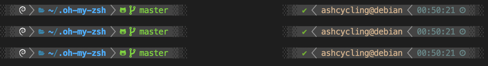

# oh-my-zsh-on-debian

- [oh-my-zsh-on-debian](#oh-my-zsh-on-debian)
  - [About](#about)
  - [How to install script](#how-to-install-script)


## About

Script for auto install and configure oh-my-zsh on debian 13. After installing your zsh will look like this:



## How to install script

```bash
bash -c "$(curl -fsSL https://github.com/ashcycling/oh-my-zsh-on-debian/raw/refs/heads/main/tools/install.sh)"
```